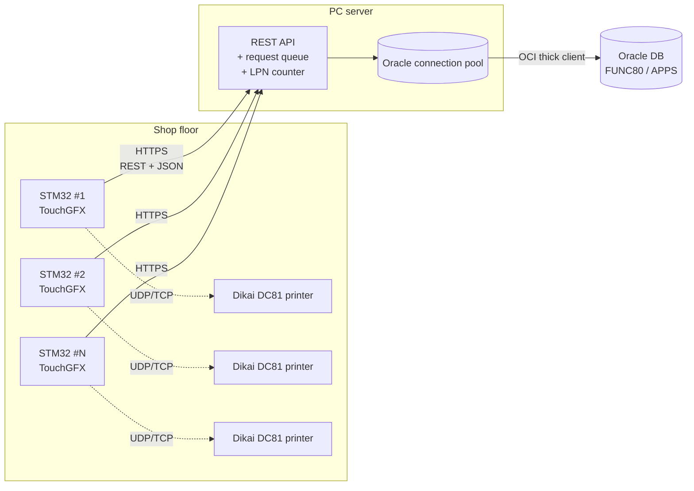
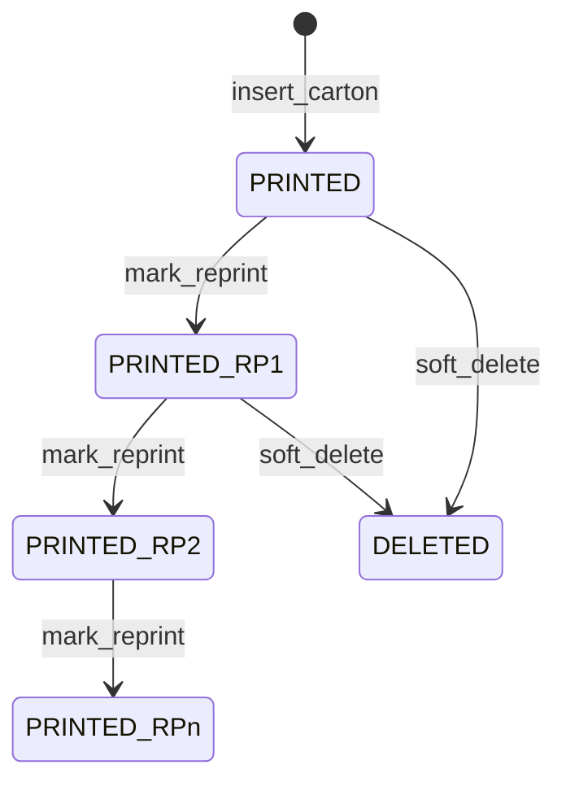
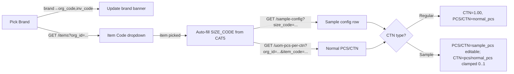
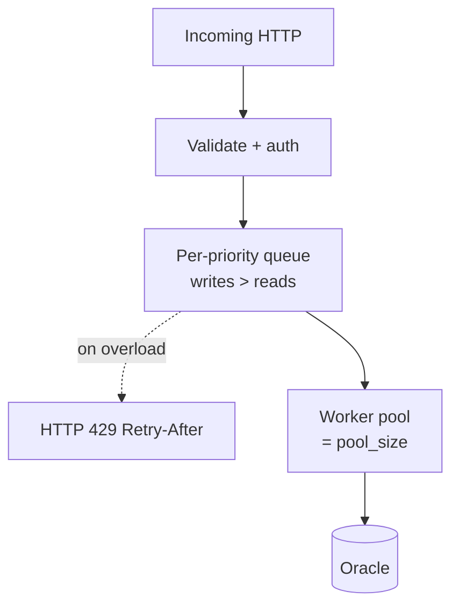
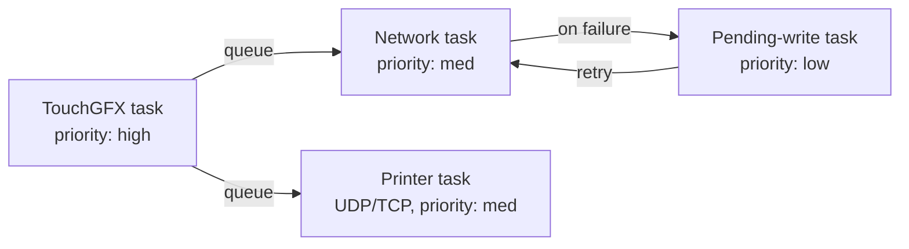

# Dikai Carton Printer — Server API Specification

> [!info] Purpose
> This document is the contract between the new **STM32 + TouchGFX carton-printing devices** and the central **PC server** that fronts Oracle. The server owns the Oracle connection pool, the LPN counter, and the request queue; each device speaks only HTTP/JSON to the server.

> [!warning] Source of truth
> All SQL in this document was extracted verbatim from the **current production code**:
> - Python build: [[core/database.py]] (latest, has `PLANT_CODE` + `TOTAL_PLANNED_QTY`)
> - C++ Qt build: [[dikai_gui_qt_cpp/src/database.cpp]] (Orange Pi, batch_master helpers retained)
> - Model: [[core/carton_model.py]] · LPN: [[core/lpn_generator.py]] · Config: [[config/config_app.py]]
>
> If the code changes, this file is **stale** until updated.

---

## 1 · System Architecture

### 1.1 Topology



### 1.2 Responsibilities

| Layer | Owns |
|---|---|
| **STM32 device** | TouchGFX UI · printer link (UDP/TCP) · LPN consumption via API · local retry queue for inserts when WiFi blips |
| **PC server** | Oracle connection pool · LPN sequence (atomic across devices) · request queue · idempotency dedup · auth tokens · device config push |
| **Oracle** | Persistence of `XXFG_CARTON_MASTER` + `XXFG_CARTON_BATCH_MASTER` (the latter via DB trigger in production) |

---

## 2 · Database Schema (current production)

### 2.1 `APPS.XXFG_CARTON_MASTER` — every printed carton

Columns the app writes (28 columns). Order matches `INSERTED_COLUMNS` in [[core/database.py#L117]].

| Column | Type | Nullable | Source / notes |
|---|---|---|---|
| `CARTON_ID` | NUMBER | NOT NULL (PK) | Allocated by server: `NVL(MAX(CARTON_ID),0)+1`. **No Oracle sequence backs it today** — mirror the pallet-app pattern. |
| `CARTON_CODE` | VARCHAR2 | NOT NULL | Same string as the LPN, e.g. `LPN-C-260612000001`. |
| `QR_CODE` | VARCHAR2 | NULL | Computed: `{ITEM_CODE}\|{LOT}\|{SHIFT}\|{date} {time}\|{SN}`. |
| `ORGANIZATION_ID` | VARCHAR2 | NULL | Brand's numeric inv_code as **string** (`"481"`, `"370"`, …). Yes — VARCHAR2, not NUMBER. |
| `PLANT_CODE` | VARCHAR2 | NULL | Brand's 3-digit org_code (`"089"`, `"064"`, …). |
| `INVENTORY_ITEM_ID` | NUMBER | NULL | **Always NULL** from this app — form doesn't know Oracle's internal ID. |
| `ITEM_CODE` | VARCHAR2 | NULL | From `XXFG_ORG_ITEMS.Item_Code`. |
| `ITEM_DESC` | VARCHAR2 | NULL | Free-text description. |
| `LOT_NUMBER` | VARCHAR2 | NULL | Operator-entered lot. |
| `CARTON_QTY` | NUMBER | NULL | CTN fraction: `1.00` for Regular, `pcs/normal_pcs` for Sample (clamped 0..1). |
| `UOM_CODE` | VARCHAR2 | NULL | **Always `"CTN"`**. |
| `LPN_ID` | NUMBER | NULL | Numeric tail only — e.g. `260612000001` from `LPN-C-260612000001`. |
| `LPN_CONTEXT` | VARCHAR2 | NULL | **Always `"CARTON"`**. |
| `BATCH_NO` | VARCHAR2 | NULL | Computed: `{ddMMMyy upper}{ITEM_CODE}{SHIFT}` -> `24JUN26AGVT157M`. |
| `BATCH_DATE` | DATE | NULL | Production calendar date. |
| `LOT_NO` | VARCHAR2 | NULL | Duplicate of `LOT_NUMBER` (schema legacy). |
| `BRAND` | VARCHAR2 | NULL | `"Monalisa"`, `"Alexander"`, etc. |
| `GRADE` | VARCHAR2 | NULL | `A` / `B` / `C`. |
| `SHIFT` | VARCHAR2 | NULL | `M` / `E` / `N` — derived from system clock (see §3.4). |
| `BATCH_TIME` | VARCHAR2 | NULL | `hh:mm AM/PM`. |
| `STATUS` | VARCHAR2 | NULL | State machine: `PRINTED` → `PRINTED-RP1` → `…-RPn` · `DELETED`. |
| `SIZE_CODE` | VARCHAR2 | NULL | Tile size from `XXFG_ORG_ITEMS.CAT5` (`"60X60"`, …). |
| `GRADE_CODE` | VARCHAR2 | NULL | Duplicate of `GRADE` (schema legacy). |
| `NO_PCS` | NUMBER | NULL | Pieces per carton — from UOM view (Regular) or sample-config (Sample). |
| `CTN_TYPE` | VARCHAR2 | NULL | `"Regular"` or `"Sample"`. (Form label says "Regular"; some code reads `"Normal"` — server accepts both.) |
| `TOTAL_PLANNED_QTY` | NUMBER | NULL | Operator-entered batch plan target. |
| `CREATED_BY` | VARCHAR2 | NOT NULL | Defaults to `"DIKAI_GUI"` — server should accept device-id-derived value. |
| `CREATION_DATE` | DATE | NOT NULL | App stamps `datetime.now()`. Server should use `SYSDATE` instead. |
| `LAST_UPDATED_BY` | VARCHAR2 | NULL | Touched only on soft-delete / reprint. |
| `LAST_UPDATE_DATE` | DATE | NULL | Touched only on soft-delete / reprint. |

> [!note] Reserved-NULL columns
> `DELIVERY_ID`, `TRANSACTION_ID`, and other WMS-integration columns stay NULL — downstream Oracle modules populate them.

### 2.2 `APPS.XXFG_CARTON_BATCH_MASTER` — batch summary

Maintained by a **DB trigger on `XXFG_CARTON_MASTER`** in production. The app only reads it. C++ build keeps the manual writers as a fallback.

| Column | Type | Source |
|---|---|---|
| `BATCH_ID` | NUMBER (PK) | `APPS.XXFG_CARTON_BATCH_S.NEXTVAL` |
| `ORGANIZATION_ID` | VARCHAR2 | from carton row |
| `BATCH_NO` | VARCHAR2 | from carton row |
| `PRODUCTION_DATE` | DATE | `TRUNC(BATCH_DATE)` |
| `ITEM_CODE` | VARCHAR2 | from carton row |
| `PRODUCT_TYPE` | VARCHAR2 | `CTN_TYPE` of the carton |
| `SIZE_CODE` | VARCHAR2 | from carton row |
| `UOM_CODE` | VARCHAR2 | from carton row |
| `BATCH_DATE` | DATE | `TRUNC(BATCH_DATE)` |
| `LOT_NO` | VARCHAR2 | `LOT_NUMBER` of the carton |
| `BRAND`, `GRADE`, `SHIFT` | VARCHAR2 | from carton row |
| `STATUS` | VARCHAR2 (`N` / `Y`) | `N` on insert; `Y` after finalize |
| `PRODUCTION_QTY` | NUMBER | `SUM(NO_PCS × (1 + reprint_count))` for the batch |
| `PRODUCED_CARTON_QTY` | NUMBER | `SUM(CARTON_QTY × (1 + reprint_count))` for the batch |

### 2.3 Reference views read by the app

| View / table | Used for |
|---|---|
| `APPS.XXFG_ORG_ITEMS` | Item code + tile size (`CAT5`) cascade after brand pick |
| `APPS.XXFG_SAMPLE_CARTON_CONFIG` | PCS/CTN + conversion lookup for Sample CTN type |
| `APPS.XXFG_UOM_CONVERSIONS_V` | PCS/CTN for Regular CTN type (direction-safe) |
| `APPS.XXFG_CARTON_BATCH_S` | Sequence backing `BATCH_ID` |

---

## 3 · Business Rules (must replicate exactly)

### 3.1 LPN format

```
LPN-C-{YY}{MM}{DD}{counter:06d}
e.g.  LPN-C-260612000001   (12 June 2026, first carton of the day)
```

- Counter is **6 digits**, zero-padded.
- Counter **resets to 1 at the start of every calendar day** (server timezone).
- Counter MUST be allocated **atomically** across all devices — see §6.2.

### 3.2 `BATCH_NO` format

```
BATCH_NO = {BATCH_DATE as 'ddMMMyy' UPPERCASE}{ITEM_CODE}{SHIFT}
e.g.      24JUN26AGVT157M
```

Built device-side in `CartonLabel.build_batch_no()` ([[core/carton_model.py#L70]]).

### 3.3 QR payload format

```
QR = {ITEM_CODE}|{LOT_NUMBER}|{SHIFT}|{batch_date} {batch_time}|{SN}
```

- `SN` is the **operator's manual serial** — printed on the carton, **never persisted to DB**.
- Built device-side in `CartonLabel.build_qr_payload()` ([[core/carton_model.py#L75]]).

### 3.4 Shift derivation

| Time-of-day (system clock) | Shift |
|---|---|
| 06:01 – 14:00 | `M` (Morning) |
| 14:01 – 22:00 | `E` (Evening) |
| 22:01 – 06:00 | `N` (Night, wraps midnight) |

Implemented in `shift_for_time()` ([[core/carton_model.py#L7]]).

### 3.5 Status state machine



Reprint suffix grows by 1 every reprint event. Soft delete is **terminal** — there is no undelete.

### 3.6 Print-count accounting (used by batch finalise)

The reprint suffix is counted as additional physical prints:

| STATUS | Physical print count |
|---|---|
| `PRINTED` | 1 |
| `PRINTED-RP1` | 2 |
| `PRINTED-RPn` | n + 1 |
| `DELETED` (any) | 0 |
| anything else | 0 |

Mirrored in Python `_print_count_from_status()` ([[core/database.py#L445]]) and in the SQL `REGEXP_LIKE(status,'-RP[0-9]+$')` expression at finalize time.

### 3.7 Reprint behaviour (critical update vs. earlier spec)

> [!warning] No automatic duplicate detection
> The current production code has **NO automatic duplicate detection** at print time. The earlier `find_duplicate()` function exists in [[core/database.py#L743]] but is **dead code** — not called by the print flow.
>
> Reprint only happens when the operator **explicitly** picks a row from the History dialog → Reprint. The very next print event is then marked as a reprint of that row instead of inserting a new carton.

This is why I have **removed** `POST /cartons/find-duplicate` from the API list since the previous draft.

### 3.8 Form auto-cascade (server-side reference data ordering)



---

## 4 · API Specification

> All endpoints under `/api/v1`. Bodies and responses are JSON. Dates are ISO-8601. All write endpoints return `{ok: bool, message: string, ...payload}`.

### Table A — Connection & Health

| Use | API | Actual Query |
|---|---|---|
| Server reachable + DB connection alive | `GET /health` | `SELECT 1 FROM DUAL` |

### Table B — Reference Data (form lookups)

| Use | API | Actual Query |
|---|---|---|
| Brand dropdown | `GET /brands` | *(server config — `[{brand, org_code, inv_code}]`)* |
| Item codes + sizes for a brand | `GET /items?org_id={oid}` | `SELECT DISTINCT Item_Code, CAT5 FROM APPS.XXFG_ORG_ITEMS WHERE ORGANIZATION_ID = :oid AND Item_Code IS NOT NULL ORDER BY Item_Code` |
| Sample carton config (PCS/CTN/conversion) for a size | `GET /sample-config?size_code={sz}` | `SELECT NORMAL_PCS_CTN, SAMPLE_PCS_CTN, CONVERSION_CTN FROM APPS.XXFG_SAMPLE_CARTON_CONFIG WHERE SIZE_CODE = :s AND ROWNUM = 1` |
| PCS/CTN from live UOM view | `GET /uom-pcs-per-ctn?org_id={oid}&item_code={code}` | `SELECT CONVERSION_RATE, PRIMARY_UOM_CODE, TARGET_UOM_CODE FROM APPS.XXFG_UOM_CONVERSIONS_V WHERE ORGANIZATION_ID = :org AND ITEM_CODE = :code AND (DISABLE_DATE IS NULL OR DISABLE_DATE > SYSDATE) ORDER BY DISABLE_DATE NULLS FIRST FETCH FIRST 1 ROWS ONLY` |

> [!note] UOM direction
> The live view stores the active carton quantity in `CONVERSION_RATE`; the server returns that value directly as `pcs_per_ctn`.

### Table C — LPN Allocation (server-owned)

| Use | API | Actual Query |
|---|---|---|
| Preview next LPN (no consume) | `GET /lpn/peek` | *(server-side: read counter for today; do NOT increment)* |
| Allocate next LPN atomically | `POST /lpn/next` body `{device_id}` | *(server-side: increment daily counter — Oracle SEQUENCE per day, or `UPDATE lpn_counter SET n=n+1 ... RETURNING n` under a row lock)* |

> [!warning] Multi-device safety
> The current file-based [[core/lpn_generator.py]] cannot coordinate multiple devices. The new server **must** own this counter; otherwise two devices will mint the same LPN.

### Table D — Carton Writes (`XXFG_CARTON_MASTER`)

| Use | API | Actual Query |
|---|---|---|
| Insert a printed carton row (server allocates `CARTON_ID`) | `POST /cartons` body = full carton row (all 28 cols, §2.1) | **(a)** `SELECT NVL(MAX(CARTON_ID),0)+1 FROM APPS.XXFG_CARTON_MASTER` <br>**(b)** `INSERT INTO APPS.XXFG_CARTON_MASTER (CARTON_ID, CARTON_CODE, QR_CODE, ORGANIZATION_ID, PLANT_CODE, INVENTORY_ITEM_ID, ITEM_CODE, ITEM_DESC, LOT_NUMBER, CARTON_QTY, UOM_CODE, LPN_ID, LPN_CONTEXT, BATCH_NO, BATCH_DATE, LOT_NO, BRAND, GRADE, SHIFT, BATCH_TIME, STATUS, SIZE_CODE, GRADE_CODE, NO_PCS, CTN_TYPE, TOTAL_PLANNED_QTY, CREATED_BY, CREATION_DATE) VALUES (:CARTON_ID, :CARTON_CODE, ...)` |
| Soft-delete a carton | `DELETE /cartons/{carton_code}` body `{by_user}` | `UPDATE APPS.XXFG_CARTON_MASTER SET STATUS='DELETED', LAST_UPDATED_BY=:u, LAST_UPDATE_DATE=SYSDATE WHERE CARTON_CODE=:cc` |
| Mark reprint (bumps `-RPn`) | `POST /cartons/{carton_code}/reprint` body `{by_user}` | `UPDATE APPS.XXFG_CARTON_MASTER SET STATUS = CASE WHEN STATUS LIKE '%-RP%' THEN REGEXP_REPLACE(STATUS,'-RP(\d+)$','-RP'\|\|(TO_NUMBER(REGEXP_SUBSTR(STATUS,'\d+$'))+1)) ELSE NVL(STATUS,'PRINTED')\|\|'-RP1' END, LAST_UPDATED_BY=:u, LAST_UPDATE_DATE=SYSDATE WHERE CARTON_CODE=:cc` |

> [!info] CARTON_ID atomicity
> Server should wrap the two-step `MAX+1` + INSERT in **one transaction** under a `SELECT … FOR UPDATE` on a counter row — or migrate to a real `SEQUENCE`. Otherwise concurrent inserts from two devices collide on the PK.

### Table E — Carton Reads (`XXFG_CARTON_MASTER`)

| Use | API | Actual Query |
|---|---|---|
| Lookup a single carton by code | `GET /cartons/{carton_code}` | `SELECT (full column set, see history query) FROM APPS.XXFG_CARTON_MASTER WHERE CARTON_CODE = :cc` |
| History list with filters | `GET /cartons` — query: `date_from, date_to, brand, item_code_like, lot_like, shift, grade, status, lpn_like, include_deleted (bool, default false), limit (default 200)` | `SELECT CARTON_CODE AS LPN_DISPLAY, CARTON_CODE, BRAND, ITEM_CODE, LOT_NUMBER, SHIFT, GRADE, SIZE_CODE, BATCH_NO, BATCH_DATE, BATCH_TIME, STATUS, QR_CODE, CARTON_ID, ORGANIZATION_ID, INVENTORY_ITEM_ID, ITEM_DESC, CARTON_QTY, UOM_CODE, LPN_ID, LPN_CONTEXT, LOT_NO, GRADE_CODE, NO_PCS, CTN_TYPE, CREATED_BY, CREATION_DATE FROM APPS.XXFG_CARTON_MASTER WHERE {dynamic AND clauses: BATCH_DATE >= :dfrom, BATCH_DATE <= :dto, BRAND = :brand, SHIFT = :shift, GRADE = :grade, STATUS LIKE :status, UPPER(ITEM_CODE) LIKE :item, UPPER(LOT_NUMBER) LIKE :lot, UPPER(CARTON_CODE) LIKE :lpn, (STATUS IS NULL OR STATUS <> 'DELETED')} ORDER BY CREATION_DATE DESC FETCH FIRST :lim ROWS ONLY` |
| Dashboard TODAY pill | `GET /cartons/count?scope=today` | Printer TCP Request Status (`S`) -> parse `PCUM(10)` and subtract today's stored baseline |
| Dashboard ALL pill | `GET /cartons/count?scope=total` | Printer TCP Request Status (`S`) -> parse `PCUM(10)` directly |

### Table F — Batch Master (`XXFG_CARTON_BATCH_MASTER`)

> [!note] Trigger-managed in production
> In the production deployment a DB trigger maintains this table after every `XXFG_CARTON_MASTER` insert. Endpoints F-3 and F-4 may be **no-ops** returning `{ok:true, source:"trigger"}` in that environment. They are kept in the spec for parity with the C++ Orange-Pi build.

| Use | API | Actual Query |
|---|---|---|
| F-1 Batch list with filters | `GET /batches` — query: `date_from, date_to, brand, shift, grade, status (exact 'N'/'Y'), item_code_like, lot_like, batch_no_like, limit (default 500)` | `SELECT BATCH_ID, ORGANIZATION_ID, BATCH_NO, PRODUCTION_DATE, ITEM_CODE, PRODUCT_TYPE, SIZE_CODE, UOM_CODE, BATCH_DATE, LOT_NO, BRAND, GRADE, SHIFT, STATUS, PRODUCTION_QTY, PRODUCED_CARTON_QTY FROM APPS.XXFG_CARTON_BATCH_MASTER WHERE {dynamic AND clauses: BATCH_DATE >= :dfrom, BATCH_DATE <= :dto, BRAND = :brand, SHIFT = :shift, GRADE = :grade, STATUS = :status, UPPER(ITEM_CODE) LIKE :item, UPPER(LOT_NO) LIKE :lot, UPPER(BATCH_NO) LIKE :bn} ORDER BY BATCH_ID DESC FETCH FIRST :lim ROWS ONLY` |
| F-2 Batch existence + finalized check | `GET /batches/status?batch_no={bn}&org_id={oid}` → `{exists, finalized}` | `SELECT MAX(CASE WHEN STATUS='Y' THEN 1 ELSE 0 END) AS finalized, COUNT(*) AS row_count FROM APPS.XXFG_CARTON_BATCH_MASTER WHERE BATCH_NO=:bn AND (:org='' OR ORGANIZATION_ID=:org)` |
| F-3 Insert initial batch row (STATUS='N') — only when trigger is NOT in place | `POST /batches` body = carton-row subset | `INSERT INTO APPS.XXFG_CARTON_BATCH_MASTER (BATCH_ID, ORGANIZATION_ID, BATCH_NO, PRODUCTION_DATE, ITEM_CODE, PRODUCT_TYPE, SIZE_CODE, UOM_CODE, BATCH_DATE, LOT_NO, BRAND, GRADE, SHIFT, STATUS, PRODUCTION_QTY, PRODUCED_CARTON_QTY) VALUES (APPS.XXFG_CARTON_BATCH_S.NEXTVAL, :org, :bn, TRUNC(:pdate), :item, :ptype, :sz_c, :uom_c, TRUNC(:bdate), :lot, :brand, :grade, :shift, 'N', :pqty, :cqty)` |
| F-4 Finalize a batch (aggregate from carton_master) | `POST /batches/{batch_no}/finalize` body `{org_id}` | `INSERT INTO APPS.XXFG_CARTON_BATCH_MASTER (BATCH_ID, ORGANIZATION_ID, BATCH_NO, PRODUCTION_DATE, ITEM_CODE, PRODUCT_TYPE, SIZE_CODE, UOM_CODE, BATCH_DATE, LOT_NO, BRAND, GRADE, SHIFT, STATUS, PRODUCTION_QTY, PRODUCED_CARTON_QTY) SELECT APPS.XXFG_CARTON_BATCH_S.NEXTVAL, x.organization_id, x.batch_no, x.production_date, x.item_code, x.product_type, x.size_code, x.uom_code, x.batch_date, x.lot_no, x.brand, x.grade, x.shift, x.status, x.production_qty, x.produced_carton_qty FROM (SELECT organization_id, batch_no, TRUNC(batch_date) production_date, item_code, ctn_type product_type, size_code, uom_code, TRUNC(batch_date) batch_date, lot_number lot_no, brand, grade, shift, 'Y' status, NVL(SUM(NVL(no_pcs,0) * (1 + CASE WHEN REGEXP_LIKE(status,'-RP[0-9]+$') THEN TO_NUMBER(REGEXP_SUBSTR(status,'[0-9]+$')) ELSE 0 END)), 0) production_qty, NVL(SUM(NVL(carton_qty,0) * (1 + CASE WHEN REGEXP_LIKE(status,'-RP[0-9]+$') THEN TO_NUMBER(REGEXP_SUBSTR(status,'[0-9]+$')) ELSE 0 END)), 0) produced_carton_qty FROM APPS.XXFG_CARTON_MASTER WHERE status LIKE 'PRINTED%' AND status NOT LIKE '%DELETED%' AND batch_no=:bn AND (:org='' OR organization_id=:org) GROUP BY organization_id, batch_no, TRUNC(batch_date), item_code, ctn_type, size_code, uom_code, lot_number, brand, grade, shift) x` |

### 4.x · Endpoint count

| Group | Endpoints |
|---|---|
| Auth | 2 (login, refresh) |
| Health | 1 |
| Reference | 4 |
| LPN | 2 |
| Carton write | 3 |
| Carton read | 3 (single, list, count with `scope=today\|total`) |
| Batch master | 4 |
| Device fleet | 3 (config read, config patch, heartbeat) |
| **Total** | **22** |

---

## 5 · Request / Response Examples

### 5.1 `POST /cartons` — insert a printed carton

**Request**
```http
POST /api/v1/cartons HTTP/1.1
Authorization: Bearer <token>
X-Device-Id: stm32-line-A-03
Idempotency-Key: 7a8f3b2e-4c1d-4e9b-9f2d-2b1c5a6d7e8f
Content-Type: application/json
```
```json
{
  "CARTON_CODE":      "LPN-C-260612000001",
  "QR_CODE":          "XGVT66143|L17|N|12 Jun 26 02:13 AM|SN-42",
  "ORGANIZATION_ID":  "481",
  "PLANT_CODE":       "089",
  "INVENTORY_ITEM_ID": null,
  "ITEM_CODE":        "XGVT66143",
  "ITEM_DESC":        "",
  "LOT_NUMBER":       "L17",
  "CARTON_QTY":       1.00,
  "UOM_CODE":         "CTN",
  "LPN_ID":           260612000001,
  "LPN_CONTEXT":      "CARTON",
  "BATCH_NO":         "12JUN26XGVT66143N",
  "BATCH_DATE":       "2026-06-12",
  "LOT_NO":           "L17",
  "BRAND":            "Monalisa",
  "GRADE":            "A",
  "SHIFT":            "N",
  "BATCH_TIME":       "02:13 AM",
  "STATUS":           "PRINTED",
  "SIZE_CODE":        "60X60",
  "GRADE_CODE":       "A",
  "NO_PCS":           4,
  "CTN_TYPE":         "Regular",
  "TOTAL_PLANNED_QTY": 5000,
  "CREATED_BY":       "DIKAI_GUI"
}
```

**Response**
```json
{
  "ok": true,
  "message": "",
  "carton_id": 814217,
  "carton_code": "LPN-C-260612000001",
  "created_at": "2026-06-12T02:13:04Z"
}
```

### 5.2 `POST /lpn/next` — allocate next LPN

**Request**
```http
POST /api/v1/lpn/next HTTP/1.1
Authorization: Bearer <token>
Idempotency-Key: c4e2d1a8-...
```
```json
{ "device_id": "stm32-line-A-03" }
```

**Response**
```json
{ "lpn_id": "LPN-C-260612000002", "lpn_num": 260612000002 }
```

### 5.3 `GET /cartons` — history filter

```http
GET /api/v1/cartons?date_from=2026-06-12&brand=Monalisa&limit=50
```

```json
[
  {
    "carton_id": 814217,
    "carton_code": "LPN-C-260612000001",
    "brand": "Monalisa",
    "item_code": "XGVT66143",
    "lot_number": "L17",
    "shift": "N",
    "grade": "A",
    "size_code": "60X60",
    "batch_no": "12JUN26XGVT66143N",
    "batch_date": "2026-06-12",
    "batch_time": "02:13 AM",
    "status": "PRINTED",
    "qr_code": "XGVT66143|L17|N|12 Jun 26 02:13 AM|SN-42",
    "organization_id": "481",
    "carton_qty": 1.00,
    "uom_code": "CTN",
    "no_pcs": 4,
    "ctn_type": "Regular",
    "total_planned_qty": 5000,
    "created_by": "DIKAI_GUI",
    "creation_date": "2026-06-12T02:13:04Z"
  }
]
```

### 5.4 Error envelope

Every endpoint on failure:
```json
{ "ok": false, "message": "DB insert failed: ORA-00001 unique constraint" , "code": "ORA-00001" }
```

HTTP status codes used:
- `200` success (or `201` for `POST /cartons` creating a row)
- `202` accepted (queued, when the server defers the write — see §6.3)
- `400` validation failure (missing required field)
- `401`/`403` auth
- `404` not found (`GET /cartons/{code}`)
- `409` conflict (idempotency-key already used with a different body)
- `429` rate-limited
- `5xx` server / Oracle problem (device retries with backoff)

---

## 6 · Server-Side Responsibilities

### 6.1 Oracle connection pool

| Setting | Recommendation |
|---|---|
| Driver | `python-oracledb` (thick) — same as current app |
| Pool size | Start with 16; size by `(devices × peak_qps × avg_query_ms / 1000)` |
| `tcp_connect_timeout` | 5 s (matches [[core/database.py#L275]]) |
| Reconnect on VPN flap | Re-init pool, do **not** kill in-flight requests — let them retry |

### 6.2 LPN allocation — pick one

| Option | Pros | Cons |
|---|---|---|
| **A. Oracle SEQUENCE per day** (`LPN_DAILY_S`) + reset job at midnight | Native Oracle atomicity; no extra table | Needs a scheduler |
| **B. Counter table + `SELECT … FOR UPDATE`** | No scheduler; reset is "set n=0 when date changes" | Lock contention at high QPS — should be fine for tens of devices |
| **C. Centralised in-memory counter with WAL** | Fastest | Extra moving part; must persist on every increment |

> [!info] Recommended: **Option B**. Lowest operational overhead, atomic, fits perfectly with the rest of the stack.

### 6.3 Request queue & load handling



- **Per-device rate limit** (e.g. 20 req/s) — protects Oracle from a misbehaving device.
- **Writes prioritised** over reads (a missed `POST /cartons` is worse than a delayed counter).
- **`Idempotency-Key` cache** (Redis or in-process LRU, TTL 24 h) — every `POST /cartons` and `POST /lpn/next` must dedup on this key.
- **Async insert option**: return `202 Accepted` immediately after queueing, allow the firmware to fire and forget — but only if the device persists pending requests locally (see §7.3). Default to synchronous `200/201` until queue depth proves it's needed.

### 6.4 Auth

| Endpoint | Use |
|---|---|
| `POST /api/v1/auth/login` body `{device_id, secret}` → `{token, expires_at}` | Device boot — exchanges a pre-shared device secret for a bearer token. |
| `POST /api/v1/auth/refresh` → `{token, expires_at}` | Refresh before expiry. |

- Tokens: JWT, 8 h TTL, signed by server.
- Device secrets stored in MCU flash (provisioned at manufacture).
- `Authorization: Bearer <token>` on every other endpoint.

### 6.5 Device config push (optional)

| Endpoint | Use |
|---|---|
| `GET /api/v1/device/{id}/config` | Pull printer + QR + message params (same shape as [[dikai_config.json]] minus `DB_*`). |
| `PATCH /api/v1/device/{id}/config` | Central tech changes printer setpoints from a dashboard. |
| `POST /api/v1/device/{id}/heartbeat` body `{state, fw_version, ip}` | Server tracks which devices are alive — for the load-balancer view. |

---

## 7 · STM32 Firmware Guidance

### 7.1 Suggested MCU + stack

| Component | Recommendation |
|---|---|
| MCU | **STM32H7** (Ethernet built-in, 1+ MB RAM headroom for TLS + TouchGFX) |
| Network | Onboard Ethernet (preferred) or WiFi via ESP-AT |
| TLS | **mbedTLS** — handshake ~30–50 kB RAM |
| JSON | **cJSON** (heap) or **jsmn** (token-only, smaller) |
| HTTP | LwIP + a thin HTTP/1.1 client (don't pull a full library) |
| RTOS | **FreeRTOS** — one task per concern (UI, network, printer) |

### 7.2 Task layout



> [!warning] Never block the UI thread
> TouchGFX runs on a single rendering loop. All HTTP calls **must** be off-thread, with results delivered to the UI via FreeRTOS queues.

### 7.3 Resilience pattern — pending-write queue

1. Operator triggers a print → UI computes the carton row.
2. UI generates an `Idempotency-Key` (UUIDv4) and **persists `{key, row}` to internal flash** (a small ring buffer is enough).
3. Network task picks up the row and `POST /cartons` it.
4. On `2xx` → erase from flash.
5. On `5xx` / timeout → retry with exponential backoff (1 s, 2 s, 5 s, 15 s, 60 s — cap at 60 s).
6. On reboot → flash is replayed, server dedups on `Idempotency-Key`.

This guarantees **no print event is ever lost**, even across power cycles.

### 7.4 LPN handling on device

- Boot: `GET /lpn/peek` once to populate the preview field.
- Print event: `POST /lpn/next` to consume. **Do not** keep a local counter.
- If `POST /lpn/next` fails: hold the print, surface "Server unreachable" to the operator, **do not** invent an LPN.

### 7.5 Reference data caching

| Cached value | TTL | Refresh trigger |
|---|---|---|
| `/brands` | 24 h | App start + Settings save |
| `/items?org_id=...` | 1 h | Brand change |
| `/sample-config?size_code=...` | 1 h | Size change |
| `/uom-pcs-per-ctn` | 1 h | Item change |

Caches survive WiFi blips — the form keeps cascading even briefly offline.

### 7.6 What stays device-local (no API)

| Concern | Why |
|---|---|
| Printer link (UDP/TCP to Dikai DC81) | Latency-critical, no server value-add |
| QR matrix rendering | Pure compute; do on MCU |
| `BATCH_NO` and `QR_CODE` string construction | Pure formatting; do on MCU |
| Shift derivation from RTC | Pure compute; do on MCU |

---

## 8 · Configuration Reference

### 8.1 Brand table (config-driven, no SQL)

Mirrors [[config/config_app.py#L109]] · `BRANDS = [(name, org_code, inv_code), …]`.

| Brand | `PLANT_CODE` (org_code) | `ORGANIZATION_ID` (inv_code) |
|---|---|---|
| Monalisa | `089` | `481` |
| X Monica | `063` | `369` |
| Alexander | `064` | `370` |
| X Tiles | `093` | `522` |
| Venus | `062` | `368` |

### 8.2 Offline sample-config fallback

Mirrors `FALLBACK_SAMPLE_CONFIG` in [[config/config_app.py#L126]]. Only used when the server is unreachable AND the device chooses to keep accepting prints (not recommended — block instead).

| SIZE_CODE | NORMAL_PCS_CTN | SAMPLE_PCS_CTN | CONVERSION_CTN |
|---|---|---|---|
| 20X30 | 25 | 10 | 0.40 |
| 25X40 | 10 | 6 | 0.60 |
| 30X45 | 8 | 6 | 0.75 |
| 30X50 | 8 | 6 | 0.75 |
| 30X60 | 6 | 6 | 1.00 |
| 40X40 | 8 | 6 | 0.75 |
| 60X60 | 4 | 4 | 1.00 |
| 30X60(ROCKX) | 5 | 6 | 1.20 |

### 8.3 Oracle target (current dev DB)

| Setting | Value |
|---|---|
| Host | `192.168.20.20` |
| Port | `1601` |
| Service | `FUNC80` |
| User | `apps` |
| Thick mode | yes (Instant Client 23.0) |

> Source: [[dikai_config.json]]. Production server should hold these in its own config file — **devices must not** know the Oracle credentials.

### 8.4 Shift / Grade enums

```python
SHIFT_OPTIONS = ["M", "N", "E"]
GRADE_OPTIONS = ["A", "B", "C"]
```

---

## 9 · Migration Notes (current → new)

| Current behaviour | New behaviour |
|---|---|
| Each device opens its own Oracle connection (`oracledb` thick client + Instant Client) | Devices speak only HTTPS to PC server; server holds the connection pool |
| LPN counter in [[lpn_state.json]] on disk | Server-owned counter (Table C) — collision-safe across devices |
| `CARTON_ID = MAX+1` from device | Server runs `MAX+1` under transaction or sequence (§6.2) |
| `find_duplicate` defined but unused | Removed from API surface |
| `batch_master` writes done by C++ build | Trigger maintains it; F-3/F-4 are no-ops in trigger mode |
| Printer-link config in [[dikai_config.json]] | Optional: push from server via `/device/{id}/config` (§6.5) |
| No auth — Oracle creds in plaintext on every device | Per-device bearer token issued by server |

---

## 10 · Open Questions

> [!question] Owner: Field engineering
> 1. Is the production batch_master DB trigger live on **all** target environments, or are some still using the manual C++ writer path? → drives whether F-3/F-4 are real endpoints or stubs.
> 2. What is the expected concurrent device count and peak print rate per device? → sizes the connection pool and queue depth.
> 3. Should the device hold prints when the server is unreachable (current behaviour: keep working with in-memory cache), or block hard? → drives §7.3.
> 4. Daily LPN reset — server timezone, or each line's local time? → drives the midnight reset job.

---

## 11 · Glossary

| Term | Meaning |
|---|---|
| LPN | "Logical Pallet Number" — the human-readable carton ID `LPN-C-YYMMDDnnnnnn`. |
| CARTON_ID | Numeric DB primary key in `XXFG_CARTON_MASTER`, allocated as `MAX+1`. |
| Reprint | A subsequent physical print of an existing carton row, tracked by the `-RPn` suffix on `STATUS`. |
| Sample CTN | Partial-carton print (less than 1 CTN). `CARTON_QTY < 1.0`, `CTN_TYPE='Sample'`. |
| Shift | `M`/`E`/`N` derived from the system clock (§3.4). |
| Idempotency-Key | Client-generated UUID sent with every write to deduplicate retries server-side. |

---

## 12 · Cross-references

- [[core/database.py]] — Python query implementations
- [[dikai_gui_qt_cpp/src/database.cpp]] — C++ query implementations
- [[core/carton_model.py]] — `CartonLabel` dataclass + `as_db_row()`
- [[core/lpn_generator.py]] — LPN counter (to be retired)
- [[config/config_app.py]] — runtime constants
- [[dikai_config.json]] — operator-tunable overrides
- [[ui/main_window.py]] — print event flow (`_on_print_event`)
- [[ui/form_panel.py]] — auto-cascade rules
